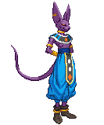
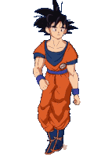
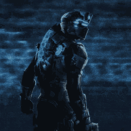

  

    

  

  <h2>
    <picture
      ></picture>
    / About me /
  </h2>

  <ul>
    <li>💻⏳ Developer in process.</li>
    <li>👻​🎮​ I like videogames.</li>
    <li>🍵 I love tea.</li>
  </ul>

  <h2>
    <picture
      ></picture>
    / Learning /
  </h2>

  

    
    
    
    
  

<h2>
  <picture
    ></picture>
/ My social networks /
</h2>

    
    
   
  

